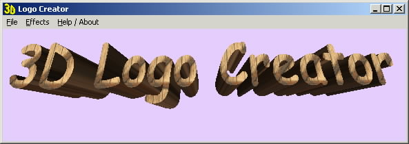



## a 3D Logo Creater

### Description

Create and manipulate 3D Logos. Apply bitmap,jpeg,gif textures to the fonts or just use colors. Apply filters to textures (nearest,linear,mipmapped) My VB installation is messed up a bit so couldn't use common dialogue to choose fonts but if anyone wants should be able to implement that quickly.

Uses API's to save the openGL scene as a bitmap

and a few to setup the openGL scene

No help file included check the code to see what keys do what.

Requires vbogl.tlb

'I got from http://is6.pacific.net.hk/~edx/tlb.htm

and ogl32.dll

'which should be included in most systems
 
### More Info
 

             |
---                |---
**Submitted On**   |2001-05-28 18:19:52
**By**             |[Matt](https://github.com/Planet-Source-Code/PSCIndex/blob/master/ByAuthor/matt.md)
**Level**          |Intermediate
**User Rating**    |4.6 (65 globes from 14 users)
**Compatibility**  |VB 6\.0
**Category**       |[Graphics](https://github.com/Planet-Source-Code/PSCIndex/blob/master/ByCategory/graphics__1-46.md)
**World**          |[Visual Basic](https://github.com/Planet-Source-Code/PSCIndex/blob/master/ByWorld/visual-basic.md)
**Archive File**   |[a 3D Logo 201885282001\.zip](https://github.com/Planet-Source-Code/matt-a-3d-logo-creater__1-23536/archive/master.zip)

